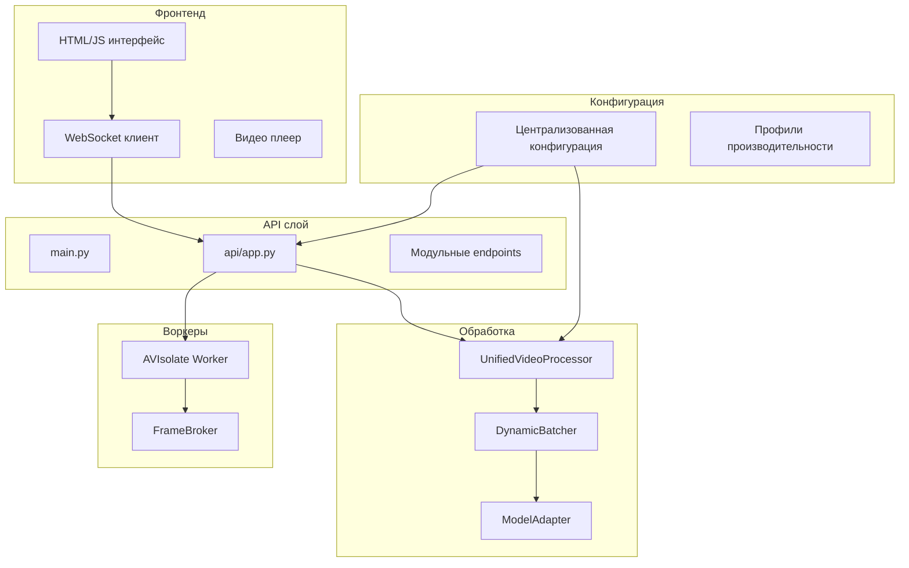

# Документ проектирования

## Обзор

Данный документ описывает техническое решение для завершения рефакторинга и стабилизации системы видеообработки PigWeight. Система представляет собой веб-приложение для обработки видео в реальном времени с использованием машинного обучения для детекции и подсчета объектов.

Основные компоненты системы:
- **FastAPI** бэкенд с WebSocket поддержкой
- **Унифицированный процессор** с адаптивным батчингом
- **Модульный фронтенд** с поддержкой WebRTC и MJPEG
- **Система воркеров** для изолированной обработки видео
- **Централизованная конфигурация** с профилями производительности

## Архитектура

### Высокоуровневая архитектура



### Компонентная архитектура

#### 1. API слой (Требование 1)
- **Проблема**: Монолитный `api/app.py` файл (2449+ строк)
- **Решение**: Разделение на модульные endpoints по функциональности

#### 2. Система типов (Требование 3)
- **Проблема**: Ошибки преобразования c10::Half ↔ float
- **Решение**: Явное управление типами данных в ModelAdapter

#### 3. Воркеры (Требование 4)
- **Проблема**: Таймауты av_worker и ошибки FRAME_BROKER
- **Решение**: Улучшенная обработка ошибок и восстановление соединений

## Компоненты и интерфейсы

### 1. Модульная структура API

```
api/
├── app.py              # Основное приложение (сокращенное)
├── endpoints/
│   ├── __init__.py
│   ├── video.py        # Видео endpoints
│   ├── stream.py       # Стриминг endpoints  
│   ├── websocket.py    # WebSocket handlers
│   ├── health.py       # Health check
│   └── files.py        # Файловые операции
├── middleware/
│   ├── __init__.py
│   ├── cors.py         # CORS middleware
│   └── error.py        # Error handling
└── dependencies.py     # Общие зависимости
```

### 2. Унифицированный процессор

```python
class UnifiedVideoProcessor:
    """Единый процессор с адаптивным батчингом"""
    
    async def process_frame_async(self, frame: np.ndarray) -> FrameResult
    async def start(self) -> None
    async def stop(self) -> None
```

### 3. Улучшенный ModelAdapter

```python
class ModelAdapter:
    """Адаптер модели с управлением типами"""
    
    def _ensure_tensor_types(self, tensors: List[torch.Tensor]) -> List[torch.Tensor]
    def _safe_type_conversion(self, tensor: torch.Tensor, target_dtype: torch.dtype) -> torch.Tensor
    def infer(self, imgs: List[np.ndarray]) -> List[Dict[str, Any]]
```

### 4. Надежный AVWorker

```python
class AVIsolate:
    """Изолированный воркер с восстановлением"""
    
    def _reconnect_on_failure(self) -> bool
    def _handle_timeout(self, operation: str) -> None
    def _req(self, cmd: str, payload: Dict, timeout: float = 1.5, retries: int = 3)
```

## Модели данных

### FrameResult
```python
@dataclass
class FrameResult:
    detections: int = 0
    confidence: float = 0.0
    masks: List[np.ndarray] = field(default_factory=list)
    bboxes: List[List[float]] = field(default_factory=list)
    centroids: List[Tuple[float, float]] = field(default_factory=list)
    preprocessed_shape: Optional[Tuple[int, int]] = None
    original_shape: Optional[Tuple[int, int]] = None
    timestamp: float = 0.0
```

### ProcessingOptions
```python
@dataclass
class ProcessingOptions:
    conf_threshold: float = 0.3
    img_size: int = 960
    device: str = "auto"
    use_half: bool = True
```

### BatcherConfig
```python
@dataclass
class BatcherConfig:
    min_batch_size: int = 1
    max_batch_size: int = 16
    target_latency_ms: float = 50.0
    adaptation_interval: float = 2.0
```

## Обработка ошибок

### 1. Система типов
```python
def safe_tensor_conversion(tensor: torch.Tensor, target_dtype: torch.dtype) -> torch.Tensor:
    """Безопасное преобразование типов тензоров"""
    try:
        if tensor.dtype == target_dtype:
            return tensor
        
        # Специальная обработка для c10::Half ↔ float
        if tensor.dtype == torch.float16 and target_dtype == torch.float32:
            return tensor.float()
        elif tensor.dtype == torch.float32 and target_dtype == torch.float16:
            return tensor.half()
        else:
            return tensor.to(target_dtype)
    except Exception as e:
        logger.warning(f"Type conversion failed: {e}, using original tensor")
        return tensor
```

### 2. Воркеры
```python
class ReliableAVWorker:
    def __init__(self, max_retries: int = 3, timeout: float = 5.0):
        self.max_retries = max_retries
        self.timeout = timeout
        self.connection_health = True
    
    async def _execute_with_retry(self, operation: Callable, *args, **kwargs):
        """Выполнение операции с повторными попытками"""
        for attempt in range(self.max_retries):
            try:
                return await operation(*args, **kwargs)
            except TimeoutError:
                if attempt < self.max_retries - 1:
                    await self._reconnect()
                else:
                    raise
            except Exception as e:
                logger.error(f"Worker operation failed (attempt {attempt + 1}): {e}")
                if attempt == self.max_retries - 1:
                    raise
```

### 3. FrameBroker
```python
class EnhancedFrameBroker:
    def __init__(self, cache_size: int = 16, max_queue_size: int = 100):
        self.cache_size = cache_size
        self.max_queue_size = max_queue_size
        self._health_check_interval = 30.0
    
    async def publish_with_backpressure(self, stream_id: str, frame_data: Dict):
        """Публикация с контролем нагрузки"""
        # Проверка размера очереди
        if self._get_queue_size(stream_id) > self.max_queue_size:
            logger.warning(f"Queue overflow for {stream_id}, dropping oldest frames")
            await self._cleanup_old_frames(stream_id)
        
        await self.publish(stream_id, **frame_data)
```

## Стратегия тестирования

### 1. Модульные тесты
```python
# tests/test_processor.py
class TestUnifiedProcessor:
    async def test_frame_processing(self):
        """Тест обработки кадра"""
        processor = UnifiedVideoProcessor("test_stream", asyncio.get_event_loop())
        frame = np.zeros((480, 640, 3), dtype=np.uint8)
        result = await processor.process_frame_async(frame)
        assert isinstance(result, FrameResult)
    
    async def test_type_conversion(self):
        """Тест преобразования типов"""
        # Тестирование c10::Half ↔ float конверсий
        pass

# tests/test_api_endpoints.py
class TestAPIEndpoints:
    def test_health_endpoint(self):
        """Тест health check"""
        pass
    
    def test_video_upload(self):
        """Тест загрузки видео"""
        pass
```

### 2. Интеграционные тесты
```python
# tests/integration/test_video_pipeline.py
class TestVideoPipeline:
    async def test_end_to_end_processing(self):
        """Тест полного пайплайна обработки видео"""
        # 1. Загрузка видео
        # 2. Запуск обработки
        # 3. Проверка результатов
        # 4. Проверка отсутствия утечек памяти
        pass
    
    async def test_worker_recovery(self):
        """Тест восстановления воркеров"""
        # 1. Симуляция сбоя воркера
        # 2. Проверка автоматического восстановления
        pass
```

### 3. Нагрузочные тесты
```python
# tests/performance/test_load.py
class TestPerformance:
    async def test_concurrent_streams(self):
        """Тест обработки нескольких потоков"""
        pass
    
    async def test_memory_usage(self):
        """Тест использования памяти"""
        pass
```

## План миграции

### Фаза 1: Рефакторинг API (Требование 1)
1. Создание модульной структуры endpoints
2. Перенос функциональности из монолитного app.py
3. Тестирование совместимости

### Фаза 2: Стабилизация типов (Требование 3)
1. Реализация safe_tensor_conversion
2. Обновление ModelAdapter
3. Тестирование на различных устройствах (CPU/GPU)

### Фаза 3: Улучшение воркеров (Требование 4)
1. Реализация retry механизмов
2. Улучшение FrameBroker
3. Мониторинг здоровья воркеров

### Фаза 4: Фронтенд стабилизация (Требование 2)
1. Улучшение обработки ошибок в UI
2. Индикаторы состояния
3. Graceful degradation

### Фаза 5: Интеграция и тестирование (Требование 5)
1. Комплексное тестирование
2. Нагрузочное тестирование
3. Документация

## Мониторинг и метрики

### Ключевые метрики
- Латентность обработки кадров
- Использование памяти
- Количество ошибок воркеров
- Пропускная способность
- Время восстановления после сбоев

### Логирование
```python
# Структурированное логирование
logger.info("Frame processed", extra={
    "stream_id": stream_id,
    "processing_time_ms": processing_time * 1000,
    "detections": result.detections,
    "memory_usage_mb": get_memory_usage()
})
```

## Безопасность

### Валидация входных данных
- Проверка размеров загружаемых файлов
- Валидация форматов видео
- Санитизация пользовательского ввода

### Управление ресурсами
- Ограничения на количество одновременных потоков
- Таймауты для операций
- Автоматическая очистка временных файлов

## Производительность

### Оптимизации
- Адаптивный батчинг для оптимальной латентности
- Кэширование результатов предобработки
- Асинхронная обработка всех I/O операций
- Профили производительности для различных сценариев

### Масштабируемость
- Горизонтальное масштабирование воркеров
- Балансировка нагрузки между процессорами
- Оптимизация использования GPU/CPU ресурсов