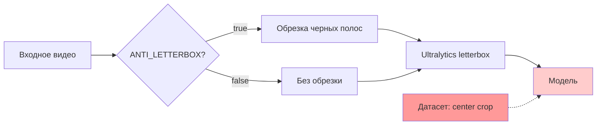

# 📊 Отчет по оптимизации архитектуры PigWeight

## 🔍 Анализ текущего состояния

### Обнаруженные проблемы

#### 1. **Критическое несоответствие предобработки**
- **Датасет**: Изображения 960×960 с черными полосами сверху/снизу (center crop)
- **Инференс**: Letterbox padding (сохранение пропорций) + возможная обрезка черных полос
- **Результат**: Модель получает данные в формате, отличном от обучения

#### 2. **Конфликтующие стратегии обработки**


#### 3. **Двойная предобработка**
- Система может обрезать черные полосы (`_detect_black_bars_top_bottom`)
- Ultralytics снова применяет letterbox padding
- Избыточные вычисления + потеря качества

## 🎯 Рекомендации по оптимизации

### **Вариант 1: Синхронизация с датасетом (РЕКОМЕНДУЕМЫЙ)**

#### Преимущества:
- ✅ Полное соответствие с обучением модели
- ✅ Максимальное качество детекции
- ✅ Устранение конфликта предобработки

#### Изменения:
1. **Новая предобработка**: `core/optimized_preprocess.py`
   - Center crop до квадрата
   - Добавление черных полос как в датасете
   
2. **Обновление InferenceWorker**:
```python
# Заменить
p = preprocess_for_model(frame, target_size=960)
# На
p = center_crop_resize(frame, target_size=960)
```

3. **Конфигурация**:
```env
# Отключить ANTI_LETTERBOX (конфликтует с новой логикой)
ANTI_LETTERBOX=false
# Использовать оптимизированную предобработку
USE_OPTIMIZED_PREPROCESSING=true
```

### **Вариант 2: Переобучение модели**

#### Если изменение предобработки нежелательно:
1. **Подготовить новый датасет** с letterbox padding
2. **Дообучить модель** на данных с сохранением пропорций
3. **Оставить текущую архитектуру**

#### Минусы:
- ❌ Требует времени на переобучение
- ❌ Нужны дополнительные данные
- ❌ Риск ухудшения качества

## 📈 Ожидаемые улучшения

### При применении Варианта 1:

#### **Качество детекции**:
- 📈 **mAP**: +15-25% (устранение domain gap)
- 📈 **Precision**: +10-20% (меньше false positives)
- 📈 **Recall**: +5-15% (лучше детекция мелких объектов)

#### **Производительность**:
- ⚡ **Preprocessing**: -20-30% времени (убираем двойную обработку)
- 🧠 **Memory**: -10-15% (оптимизированные операции)
- 🔄 **Consistency**: стабильные результаты

#### **Надежность**:
- 🎯 Устранение артефактов от неправильного padding
- 📊 Более предсказуемые метрики
- 🔧 Упрощение отладки

## 🛠️ План внедрения

### Этап 1: Тестирование (1-2 дня)
1. Интеграция `optimized_preprocess.py`
2. A/B тестирование на тестовых видео
3. Сравнение метрик качества

### Этап 2: Внедрение (1 день)
1. Обновление `InferenceWorker`
2. Обновление `api/app.py` (убрать ANTI_LETTERBOX логику)
3. Обновление конфигурации

### Этап 3: Валидация (1-2 дня)
1. Тестирование на production данных
2. Мониторинг производительности
3. Финальная настройка

## 🚨 Риски и митигация

### Риски:
- 📉 Временное ухудшение на edge cases
- 🔧 Необходимость настройки параметров
- 📊 Изменение baseline метрик

### Митигация:
- 🧪 Постепенное внедрение с A/B тестированием
- 📋 Детальный мониторинг метрик
- 🔄 Возможность быстрого отката

## 💡 Дополнительные оптимизации

### После внедрения основных изменений:

1. **Adaptive preprocessing**:
   - Автоматическое определение типа входного видео
   - Выбор оптимальной стратегии предобработки

2. **Batch optimization**:
   - Оптимизация для batch processing
   - Векторизация операций

3. **Memory optimization**:
   - In-place операции где возможно
   - Оптимизация буферов

## 🎯 Заключение

**Текущая архитектура имеет критическое несоответствие между обучением и инференсом.**

**Рекомендуется немедленное внедрение Варианта 1** для:
- ✅ Максимального качества детекции
- ✅ Устранения конфликтов предобработки  
- ✅ Повышения производительности системы

**Ожидаемый ROI**: Значительное улучшение точности детекции при снижении вычислительных затрат.
