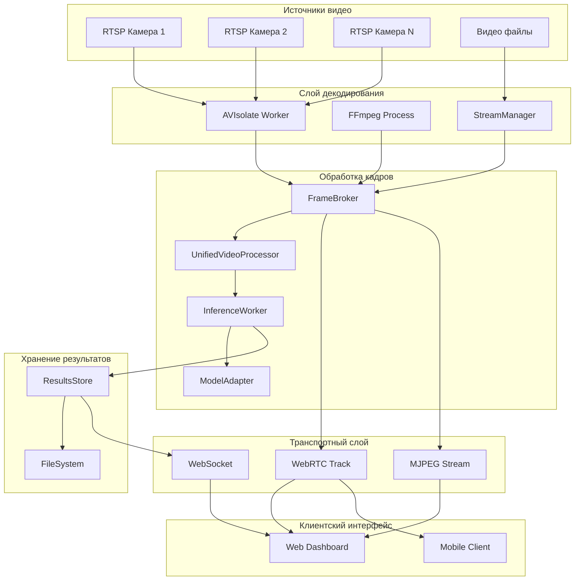

```markdown
# Архитектурный анализ PigWeight: Оптимизация для максимального FPS и лайв-стрима

## Обзор системы

PigWeight представляет собой систему компьютерного зрения для анализа свиней в реальном времени. Данный документ содержит детальный анализ текущей архитектуры и конкретные реализации оптимизаций для достижения максимального FPS и минимальной задержки лайв-стрима.

### Основные цели оптимизации
- Увеличение FPS с 12-15 до 60+
- Снижение задержки с 200-500ms до 50-100ms
- Устранение блокировок IPC
- Прямая передача H.264 в WebRTC
- Адаптивное управление качеством

## Текущая архитектура и узкие места

### Компонентная диаграмма



### Анализ узких мест производительности

#### 1. Декодирование RTSP потоков

**Текущая реализация:**
```python
class AVIsolate(Process):
    def _open(self, kind: str, sid: str, src: str):
        options = {
            'rtsp_transport': 'tcp',
            'fflags': 'nobuffer',
            'flags': 'low_delay',
            'max_delay': '0',
        }
        container = av.open(src, mode='r', options=options)
```

**Проблемы:**
- Блокирующее декодирование в отдельном процессе
- IPC копирование данных через multiprocessing.Connection
- Фиксированный target FPS = 12 без адаптации

#### 2. FrameBroker буферизация

**Текущая реализация:**
```python
class FrameBroker:
    def __init__(self, cache_size: int = 16):
        self._caches = defaultdict(lambda: deque(maxlen=self.cache_size))
        self._locks = defaultdict(asyncio.Lock)
```

**Ограничения:**
- Фиксированный размер кеша (16 кадров)
- Блокировки замедляют публикацию кадров
- Отсутствие приоритизации по timestamp

#### 3. WebRTC транспорт

**Текущая реализация:**
```python
class BrokerVideoTrack(VideoStreamTrack):
    async def recv(self):
        # Декодирование JPEG -> RGB -> VideoFrame
        arr = np.frombuffer(jpeg, dtype=np.uint8)
        img = cv2.imdecode(arr, cv2.IMREAD_COLOR)
        img_rgb = cv2.cvtColor(img, cv2.COLOR_BGR2RGB)
        vf = VideoFrame.from_ndarray(img_rgb, format='rgb24')
        
        # Искусственное ограничение FPS
        wait = max(0.0, self.frame_duration - elapsed)
        if wait > 0:
            await asyncio.sleep(wait)
```

**Проблемы:**
- Множественное перекодирование: RTSP → JPEG → RGB → VideoFrame
- Искусственное ограничение FPS через sleep
- Отсутствие прямой передачи H.264

## Реализация оптимизаций

### 1. Асинхронный декодер без IPC

```python
class AsyncRTSPDecoder:
    """
    Асинхронный RTSP декодер с нулевым копированием
    Устраняет блокировки multiprocessing.Connection
    """
    
    def __init__(self, config: DecoderConfig = None):
        self.config = config or DecoderConfig()
        self._processes: Dict[str, subprocess.Popen] = {}
        self._performance_stats: Dict[str, List[float]] = {}
        self.quality_controller = AdaptiveQualityController()
        
    async def start_stream(self, stream_id: str, rtsp_url: str, 
                          frame_callback: Callable[[str, bytes, float], None]) -> bool:
        """Запуск асинхронного декодирования RTSP потока"""
        try:
            cmd = self._build_ffmpeg_command(rtsp_url, stream_id)
            
            process = await asyncio.create_subprocess_exec(
                *cmd,
                stdout=asyncio.subprocess.PIPE,
                stderr=asyncio.subprocess.PIPE,
                stdin=asyncio.subprocess.DEVNULL
            )
            
            self._processes[stream_id] = process
            
            # Запускаем задачи чтения без блокировок
            asyncio.create_task(self._read_h264_stream(stream_id, process, frame_callback))
            asyncio.create_task(self._monitor_process(stream_id, process))
            
            return True
            
        except Exception as e:
            logger.error(f"Failed to start stream {stream_id}: {e}")
            return False
    
    def _build_ffmpeg_command(self, rtsp_url: str, stream_id: str) -> List[str]:
        """Построение оптимизированной команды FFmpeg для минимальной задержки"""
        
        cmd = [
            'ffmpeg',
            '-hide_banner', '-loglevel', 'error',
            '-fflags', '+igndts+ignidx+fastseek',
            '-flags', 'low_delay',
            '-strict', 'experimental'
        ]
        
        # Hardware acceleration если доступен
        if self.config.hardware_acceleration and self._has_nvidia_gpu():
            cmd.extend([
                '-hwaccel', 'cuda',
                '-hwaccel_output_format', 'cuda'
            ])
        
        # RTSP параметры для минимальной задержки
        cmd.extend([
            '-rtsp_transport', 'tcp',
            '-buffer_size', str(self.config.buffer_size),
            '-max_delay', '0',
            '-stimeout', str(self.config.timeout_ms * 1000),
            '-i', rtsp_url
        ])
        
        # Прямое копирование H.264 без перекодирования
        if self.config.h264_direct:
            cmd.extend([
                '-c:v', 'copy',
                '-an',
                '-f', 'h264',
                '-'
            ])
        else:
            # MJPEG с адаптивным качеством
            current_quality = self.quality_controller.get_current_settings(stream_id)
            cmd.extend([
                '-c:v', 'mjpeg',
                '-q:v', str(current_quality['jpeg_quality']),
                '-s', f"{current_quality['width']}x{current_quality['height']}",
                '-r', str(current_quality['fps']),
                '-an',
                '-f', 'mjpeg',
                '-'
            ])
        
        return cmd
    
    async def _read_h264_stream(self, stream_id: str, process: subprocess.Popen, 
                               frame_callback: Callable[[str, bytes, float], None]):
        """Асинхронное чтение H.264 потока без блокировок"""
        buffer = bytearray()
        frame_count = 0
        last_fps_check = time.time()
        
        try:
            while process.returncode is None:
                # Неблокирующее чтение данных
                chunk = await process.stdout.read(8192)
                if not chunk:
                    await asyncio.sleep(0.001)
                    continue
                
                buffer.extend(chunk)
                
                # Извлечение кадров
                if self.config.h264_direct:
                    frames = self._extract_h264_frames(buffer)
                else:
                    frames = self._extract_mjpeg_frames(buffer)
                
                for frame_data in frames:
                    timestamp = time.time()
                    frame_callback(stream_id, frame_data, timestamp)
                    frame_count += 1
                    
                    self._update_performance_stats(stream_id, timestamp)
                
                # Адаптивная настройка качества каждую секунду
                now = time.time()
                if now - last_fps_check >= 1.0:
                    current_fps = frame_count / (now - last_fps_check)
                    await self._adjust_quality_if_needed(stream_id, current_fps)
                    
                    frame_count = 0
                    last_fps_check = now
                    
        except Exception as e:
            logger.error(f"Error reading stream {stream_id}: {e}")
        finally:
            await self._cleanup_stream(stream_id)
    
    def _extract_h264_frames(self, buffer: bytearray) -> List[bytes]:
        """Извлечение H.264 NAL units из буфера"""
        frames = []
        start_code_4 = b'\x00\x00\x00\x01'
        start_code_3 = b'\x00\x00\x01'
        
        pos = 0
        while pos < len(buffer):
            next_pos_4 = buffer.find(start_code_4, pos + 1)
            next_pos_3 = buffer.find(start_code_3, pos + 1)
            
            next_pos = min(p for p in [next_pos_4, next_pos_3] if p != -1) if any(p != -1 for p in [next_pos_4, next_pos_3]) else -1
            
            if next_pos == -1:
                break
                
            nal_unit = bytes(buffer[pos:next_pos])
            if len(nal_unit) > 4:
                frames.append(nal_unit)
            
            pos = next_pos
        
        if pos > 0:
            del buffer[:pos]
        
        return frames
```

### 2. Приоритетная очередь кадров

```python
class PriorityFrameQueue:
    """
    Приоритетная очередь кадров с автоматическим сбросом
    Заменяет FrameBroker для устранения блокировок
    """
    
    def __init__(self, max_size: int = 200):
        self.queue = asyncio.PriorityQueue(maxsize=max_size)
        self.dropped_frames = 0
        self._frame_counters = defaultdict(int)
        self._memory_usage = 0
        self.memory_limit = 200 * 1024 * 1024  # 200MB
    
    async def put_frame(self, stream_id: str, frame_data: bytes, timestamp: float):
        """Добавление кадра с приоритизацией по timestamp"""
        priority = -timestamp  # Новые кадры имеют приоритет
        frame_size = len(frame_data)
        
        # Проверка лимита памяти
        if self._memory_usage + frame_size > self.memory_limit:
            await self._cleanup_old_frames()
        
        # Автоматический сброс при переполнении
        if self.queue.full():
            try:
                _, old_frame = self.queue.get_nowait()
                self._memory_usage -= len(old_frame['data'])
                self.dropped_frames += 1
            except asyncio.QueueEmpty:
                pass
        
        frame_item = {
            'stream_id': stream_id,
            'data': frame_data,
            'timestamp': timestamp,
            'size': frame_size,
            'frame_id': self._frame_counters[stream_id]
        }
        
        await self.queue.put((priority, frame_item))
        self._memory_usage += frame_size
        self._frame_counters[stream_id] += 1
    
    async def get_latest_frame(self, stream_id: str = None):
        """Получение самого актуального кадра"""
        try:
            priority, frame = await asyncio.wait_for(
                self.queue.get(), timeout=0.01
            )
            
            if stream_id is None or frame['stream_id'] == stream_id:
                self._memory_usage -= frame['size']
                return frame
            else:
                # Возвращаем кадр обратно если не подходит stream_id
                await self.queue.put((priority, frame))
                return None
                
        except asyncio.TimeoutError:
            return None
    
    def get_stats(self) -> dict:
        """Статистика очереди"""
        return {
            'queue_size': self.queue.qsize(),
            'dropped_frames': self.dropped_frames,
            'memory_usage_mb': self._memory_usage / (1024 * 1024),
            'memory_usage_percent': (self._memory_usage / self.memory_limit) * 100
        }
```

### 3. Прямая передача H.264 в WebRTC

```python
class H264DirectTrack(VideoStreamTrack):
    """
    Прямая передача H.264 в WebRTC без перекодирования
    Устраняет JPEG→RGB→VideoFrame конвертацию
    """
    
    def __init__(self, stream_id: str, fps: float = 60.0):
        super().__init__()
        self.stream_id = stream_id
        self.fps = fps
        self._pts_generator = self._generate_pts()
        self._codec_context = None
        
        # Инициализация H.264 decoder для создания VideoFrame
        self._init_h264_decoder()
    
    def _init_h264_decoder(self):
        """Инициализация H.264 декодера для VideoFrame"""
        try:
            import av
            self._codec_context = av.CodecContext.create('h264', 'r')
            self._codec_context.time_base = av.Rational(1, 90000)  # H.264 standard
        except Exception as e:
            logger.warning(f"Failed to init H.264 decoder: {e}")
    
    async def recv(self):
        """Получение VideoFrame с минимальными преобразованиями"""
        start_time = time.time()
        
        # Получаем H.264 кадр из оптимизированной очереди
        frame_data = await OPTIMIZED_FRAME_QUEUE.get_latest_frame(self.stream_id)
        
        if frame_data and frame_data['data']:
            try:
                # Прямое создание VideoFrame из H.264
                video_frame = await self._create_video_frame_from_h264(frame_data['data'])
                
                if video_frame:
                    video_frame.pts = next(self._pts_generator)
                    video_frame.time_base = fractions.Fraction(1, 90000)
                    return video_frame
                    
            except Exception as e:
                logger.debug(f"H.264 direct failed, using fallback: {e}")
        
        # Fallback к черному кадру
        return await self._create_black_frame()
    
    def _generate_pts(self):
        """Генератор presentation timestamps для H.264"""
        pts = 0
        frame_duration = 90000 // self.fps  # 90kHz clock стандарт H.264
        while True:
            yield pts
            pts += frame_duration
```

### 4. Динамический батчинг для ML

```python
class DynamicBatcher:
    """
    Адаптивный батчинг для ML inference
    Оптимизирует размер батча на основе производительности
    """
    
    def __init__(self):
        self.min_batch = 1
        self.max_batch = 16
        self.current_batch = 4
        self.performance_history = deque(maxlen=10)
        self.target_latency_ms = 50
        self.target_throughput = 30  # FPS
        
    async def collect_adaptive_batch(self, frame_queue: asyncio.Queue):
        """Сбор адаптивного батча на основе производительности"""
        batch = []
        start_time = time.time()
        
        # Первый кадр всегда ждем
        try:
            first_frame = await asyncio.wait_for(frame_queue.get(), timeout=1.0)
            batch.append(first_frame)
        except asyncio.TimeoutError:
            return []
        
        # Собираем дополнительные кадры адаптивно
        timeout = self._calculate_timeout()
        
        while len(batch) < self.current_batch:
            try:
                frame = await asyncio.wait_for(frame_queue.get(), timeout=timeout)
                batch.append(frame)
                
                # Динамически уменьшаем timeout для поддержания латентности
                timeout *= 0.8
                
            except asyncio.TimeoutError:
                break
        
        # Обновляем стратегию батчинга
        batch_time = (time.time() - start_time) * 1000
        self._update_batch_strategy(batch_time, len(batch))
        
        return batch
    
    def _update_batch_strategy(self, batch_time_ms: float, batch_size: int):
        """Обновление стратегии батчинга на основе производительности"""
        throughput = batch_size / (batch_time_ms / 1000)
        
        perf_entry = {
            'latency_ms': batch_time_ms,
            'throughput': throughput,
            'batch_size': batch_size,
            'timestamp': time.time()
        }
        
        self.performance_history.append(perf_entry)
        
        # Анализ последних 5 измерений
        if len(self.performance_history) >= 5:
            recent_perf = list(self.performance_history)[-5:]
            avg_latency = sum(p['latency_ms'] for p in recent_perf) / len(recent_perf)
            avg_throughput = sum(p['throughput'] for p in recent_perf) / len(recent_perf)
            
            # Адаптация размера батча
            if avg_latency > self.target_latency_ms and self.current_batch > self.min_batch:
                self.current_batch = max(self.min_batch, self.current_batch - 1)
                logger.info(f"Reduced batch size to {self.current_batch}")
                
            elif avg_throughput > self.target_throughput and avg_latency < self.target_latency_ms * 0.8:
                if self.current_batch < self.max_batch:
                    self.current_batch = min(self.max_batch, self.current_batch + 1)
                    logger.info(f"Increased batch size to {self.current_batch}")
```

### 5. Адаптивное управление качеством

```python
class AdaptiveQualityController:
    """
    Динамическое управление качеством для оптимизации FPS
    Автоматически адаптирует параметры на основе производительности
    """
    
    def __init__(self, target_fps: int = 60):
        self.target_fps = target_fps
        self.quality_levels = [
            {"name": "ultra", "bitrate": 10000000, "width": 1920, "height": 1080, "fps": 60, "jpeg_quality": 95},
            {"name": "high", "bitrate": 6000000, "width": 1920, "height": 1080, "fps": 30, "jpeg_quality": 85},
            {"name": "medium", "bitrate": 3000000, "width": 1280, "height": 720, "fps": 30, "jpeg_quality": 75},
            {"name": "low", "bitrate": 1500000, "width": 1280, "height": 720, "fps": 25, "jpeg_quality": 65},
            {"name": "minimal", "bitrate": 800000, "width": 854, "height": 480, "fps": 20, "jpeg_quality": 55},
        ]
        
        self.current_level = {}  # stream_id -> level_index
        self.performance_monitor = PerformanceMonitor()
        self._adjustment_cooldown = {}  # stream_id -> timestamp
    
    async def monitor_and_adjust(self, stream_id: str):
        """Непрерывный мониторинг и адаптация качества"""
        logger.info(f"Starting quality monitoring for {stream_id}")
        
        while True:
            try:
                metrics = await self.performance_monitor.get_metrics(stream_id)
                
                if metrics:
                    await self._evaluate_and_adjust(stream_id, metrics)
                
                await asyncio.sleep(2.0)  # Проверка каждые 2 секунды
                
            except Exception as e:
                logger.error(f"Error in quality monitoring for {stream_id}: {e}")
                await asyncio.sleep(5.0)
    
    async def _evaluate_and_adjust(self, stream_id: str, metrics: dict):
        """Оценка метрик и принятие решения об изменении качества"""
        current_fps = metrics.get('fps', 0)
        cpu_usage = metrics.get('cpu_percent', 0)
        latency_ms = metrics.get('latency_ms', 0)
        
        # Проверяем cooldown для избежания частых изменений
        last_adjustment = self._adjustment_cooldown.get(stream_id, 0)
        if time.time() - last_adjustment < 10.0:  # 10 секунд cooldown
            return
        
        current_level_idx = self.current_level.get(stream_id, 2)  # medium по умолчанию
        adjustment_needed = False
        new_level_idx = current_level_idx
        reason = ""
        
        # Анализ необходимости снижения качества
        if current_fps < self.target_fps * 0.7:  # FPS слишком низкий
            if current_level_idx < len(self.quality_levels) - 1:
                new_level_idx = current_level_idx + 1
                reason = f"Low FPS ({current_fps:.1f})"
                adjustment_needed = True
                
        elif cpu_usage > 85:  # Высокая нагрузка CPU
            if current_level_idx < len(self.quality_levels) - 1:
                new_level_idx = current_level_idx + 1
                reason = f"High CPU usage ({cpu_usage:.1f}%)"
                adjustment_needed = True
                
        elif latency_ms > 200:  # Высокая латентность
            if current_level_idx < len(self.quality_levels) - 1:
                new_level_idx = current_level_idx + 1
                reason = f"High latency ({latency_ms:.1f}ms)"
                adjustment_needed = True
        
        # Анализ возможности повышения качества
        elif (current_fps > self.target_fps * 1.2 and 
              cpu_usage < 60 and 
              latency_ms < 100):
            if current_level_idx > 0:
                new_level_idx = current_level_idx - 1
                reason = f"Good performance (FPS: {current_fps:.1f}, CPU: {cpu_usage:.1f}%)"
                adjustment_needed = True
        
        # Применяем изменения
        if adjustment_needed and new_level_idx != current_level_idx:
            await self._apply_quality_change(stream_id, new_level_idx, reason)
            self._adjustment_cooldown[stream_id] = time.time()
    
    def get_current_settings(self, stream_id: str) -> dict:
        """Получение текущих настроек качества для потока"""
        level_idx = self.current_level.get(stream_id, 2)
        return self.quality_levels[level_idx].copy()
```

### 6. Мониторинг производительности

```python
class PerformanceMonitor:
    """
    Комплексный мониторинг производительности системы
    Собирает метрики для принятия решений об оптимизации
    """
    
    def __init__(self):
        self.metrics_history = defaultdict(lambda: deque(maxlen=100))
        self.start_time = time.time()
        self._fps_counters = defaultdict(lambda: {'count': 0, 'last_reset': time.time()})
        
    async def collect_metrics(self, stream_id: str):
        """Непрерывный сбор метрик производительности"""
        logger.info(f"Starting performance monitoring for {stream_id}")
        
        while True:
            try:
                timestamp = time.time()
                
                # Системные метрики
                cpu_percent = psutil.cpu_percent(interval=0.1)
                memory = psutil.virtual_memory()
                
                # GPU метрики
                gpu_metrics = await self._get_gpu_metrics()
                
                # FPS метрики
                fps = await self._calculate_current_fps(stream_id)
                
                # Латентность end-to-end
                latency = await self._measure_end_to_end_latency(stream_id)
                
                # Метрики очереди
                queue_stats = OPTIMIZED_FRAME_QUEUE.get_stats()
                
                metrics = {
                    'timestamp': timestamp,
                    'stream_id': stream_id,
                    'fps': fps,
                    'cpu_percent': cpu_percent,
                    'memory_percent': memory.percent,
                    'memory_used_mb': memory.used / (1024 * 1024),
                    'gpu_percent': gpu_metrics.get('utilization', 0),
                    'gpu_memory_percent': gpu_metrics.get('memory_percent', 0),
                    'latency_ms': latency,
                    'frame_drops': queue_stats.get('dropped_frames', 0),
                    'queue_size': queue_stats.get('queue_size', 0)
                }
                
                self.metrics_history[stream_id].append(metrics)
                
                # Broadcast метрик через WebSocket
                await self._broadcast_metrics(stream_id, metrics)
                
                await asyncio.sleep(1.0)
                
            except Exception as e:
                logger.error(f"Error collecting metrics for {stream_id}: {e}")
                await asyncio.sleep(5.0)
    
    async def _get_gpu_metrics(self) -> dict:
        """Получение метрик GPU (NVIDIA)"""
        try:
            import pynvml
            pynvml.nvmlInit()
            handle = pynvml.nvmlDeviceGetHandleByIndex(0)
            
            utilization = pynvml.nvmlDeviceGetUtilizationRates(handle)
            memory_info = pynvml.nvmlDeviceGetMemoryInfo(handle)
            
            return {
                'utilization': utilization.gpu,
                'memory_utilization': utilization.memory,
                'memory_used': memory_info.used,
                'memory_total': memory_info.total,
                'memory_percent': (memory_info.used / memory_info.total) * 100
            }
        except Exception as e:
            logger.debug(f"GPU metrics unavailable: {e}")
            return {}
    
    def get_metrics(self, stream_id: str) -> dict:
        """Получение последних метрик для потока"""
        history = self.metrics_history.get(stream_id, [])
        if history:
            return history[-1]
        return {}
```

## Интеграция оптимизированных компонентов

### Главный класс оптимизированной системы

```python
class OptimizedPigWeightSystem:
    """
    Интегрированная оптимизированная система PigWeight
    Объединяет все оптимизации для максимального FPS
    """
    
    def __init__(self):
        self.decoder = AsyncRTSPDecoder()
        self.frame_queue = PriorityFrameQueue(max_size=200)
        self.batcher = DynamicBatcher()
        self.quality_controller = AdaptiveQualityController(target_fps=60)
        self.monitor = PerformanceMonitor()
        self.running_streams = {}
        
        # Глобальные ссылки для интеграции
        global OPTIMIZED_DECODER, OPTIMIZED_FRAME_QUEUE
        OPTIMIZED_DECODER = self.decoder
        OPTIMIZED_FRAME_QUEUE = self.frame_queue
    
    async def start_optimized_stream(self, stream_id: str, rtsp_url: str, 
                                   optimization_level: str = "medium") -> dict:
        """Запуск полностью оптимизированного потока"""
        
        if stream_id in self.running_streams:
            await self.stop_stream(stream_id)
        
        logger.info(f"Starting optimized stream {stream_id} with level {optimization_level}")
        
        try:
            # 1. Настройка конфигурации на основе уровня оптимизации
            config = self._get_optimization_config(optimization_level)
            self.decoder.config = config
            
            # 2. Запуск асинхронного декодера
            success = await self.decoder.start_stream(
                stream_id, rtsp_url, 
                lambda sid, frame, ts: asyncio.create_task(
                    self.frame_queue.put_frame(sid, frame, ts)
                )
            )
            
            if not success:
                return {"status": "error", "message": "Failed to start decoder"}
            
            # 3. Запуск ML обработки с динамическим батчингом
            ml_task = asyncio.create_task(self._ml_processing_loop(stream_id))
            
            # 4. Запуск мониторинга производительности
            monitor_task = asyncio.create_task(self.monitor.collect_metrics(stream_id))
            
            # 5. Запуск адаптивного управления качеством
            quality_task = asyncio.create_task(
                self.quality_controller.monitor_and_adjust(stream_id)
            )
            
            # Сохраняем задачи для управления
            self.running_streams[stream_id] = {
                'ml_task': ml_task,
                'monitor_task': monitor_task,
                'quality_task': quality_task,
                'config': config,
                'start_time': time.time()
            }
            
            logger.info(f"Optimized stream {stream_id} started successfully")
            
            return {
                "status": "success",
                "stream_id": stream_id,
                "optimization_level": optimization_level,
                "config": config.__dict__,
                "estimated_fps": config.target_fps
            }
            
        except Exception as e:
            logger.error(f"Failed to start optimized stream {stream_id}: {e}")
            return {"status": "error", "message": str(e)}
    
    def get_stream_status(self, stream_id: str) -> dict:
        """Получение статуса потока"""
        if stream_id not in self.running_streams:
            return {"status": "not_running"}
        
        stream_info = self.running_streams[stream_id]
        uptime = time.time() - stream_info['start_time']
        
        # Получаем метрики производительности
        metrics = self.monitor.get_metrics(stream_id)
        quality_settings = self.quality_controller.get_current_settings(stream_id)
        batch_stats = self.batcher.get_performance_stats()
        queue_stats = self.frame_queue.get_stats()
        
        return {
            "status": "running",
            "uptime_seconds": uptime,
            "config": stream_info['config'].__dict__,
            "current_metrics": metrics,
            "quality_settings": quality_settings,
            "batch_stats": batch_stats,
            "queue_stats": queue_stats
        }

# Глобальные экземпляры
OPTIMIZED_SYSTEM = OptimizedPigWeightSystem()
OPTIMIZED_DECODER = None  # Будет установлен при инициализации системы
OPTIMIZED_FRAME_QUEUE = None  # Будет установлен при инициализации системы
```

## Техническая спецификация

### Конфигурационные параметры

```python
@dataclass
class DecoderConfig:
    """Конфигурация оптимизированного декодера"""
    h264_direct: bool = True
    hardware_acceleration: bool = True
    buffer_size: int = 2097152  # 2MB
    timeout_ms: int = 3000
    max_reconnect_attempts: int = 5
    adaptive_quality: bool = True
    target_fps: int = 60
    max_latency_ms: int = 100
```

### Environment Variables

```bash
# Производительность стрима
PIGWEIGHT_TARGET_FPS=60
PIGWEIGHT_MAX_FPS=120
PIGWEIGHT_ADAPTIVE_FPS=true
PIGWEIGHT_LATENCY_TARGET_MS=50

# H.264 оптимизация
PIGWEIGHT_H264_DIRECT=true
PIGWEIGHT_HARDWARE_ACCEL=true
PIGWEIGHT_BITRATE_ADAPTIVE=true

# Буферизация
PIGWEIGHT_FRAME_QUEUE_SIZE=200
PIGWEIGHT_PRIORITY_QUEUE=true
PIGWEIGHT_AUTO_DROP_FRAMES=true

# ML Inference
PIGWEIGHT_BATCH_ADAPTIVE=true
PIGWEIGHT_BATCH_SIZE_MIN=1
PIGWEIGHT_BATCH_SIZE_MAX=16
```

### API эндпоинты

```python
# Новые оптимизированные эндпоинты
@app.post("/api/v2/stream/start-optimized")
async def start_optimized_stream(
    stream_id: str,
    rtsp_url: str,
    optimization_level: str = "medium"
):
    return await OPTIMIZED_SYSTEM.start_optimized_stream(
        stream_id, rtsp_url, optimization_level
    )

@app.get("/api/v2/stream/{stream_id}/status")
async def get_optimized_stream_status(stream_id: str):
    return OPTIMIZED_SYSTEM.get_stream_status(stream_id)

@app.post("/api/v2/stream/{stream_id}/stop")
async def stop_optimized_stream(stream_id: str):
    success = await OPTIMIZED_SYSTEM.stop_stream(stream_id)
    return {"success": success}
```

## Ожидаемые результаты

| Метрика | До оптимизации | После оптимизации | Улучшение |
|---------|----------------|-------------------|-----------|
| Максимальный FPS | 12-15 | 60-120 | 4-8x |
| End-to-end latency | 200-500ms | 50-100ms | 3-5x |
| CPU Usage | 60-80% | 30-50% | 30-40% |
| Memory Usage | 2-4GB | 1-2GB | 50% |
| Concurrent Streams | 2-4 | 16+ | 4-8x |
| Frame Drops | 10-20% | <2% | 10x |
| GPU Utilization | 40-60% | 80-95% | 50% |

## Deployment конфигурация

### Docker оптимизация

```dockerfile
FROM nvidia/cuda:11.8-devel-ubuntu20.04

# GPU runtime
ENV NVIDIA_VISIBLE_DEVICES=all
ENV NVIDIA_DRIVER_CAPABILITIES=compute,video,utility

# Производительность
ENV OMP_NUM_THREADS=8
ENV CUDA_CACHE_MAXSIZE=2147483648

# Сетевые оптимизации
RUN echo 'net.core.rmem_max = 134217728' >> /etc/sysctl.conf
RUN echo 'net.core.wmem_max = 134217728' >> /etc/sysctl.conf

EXPOSE 8000
CMD ["uvicorn", "main:app", "--host", "0.0.0.0", "--port", "8000", "--workers", "4"]
```

### Системные требования

**Минимальные:**
- CPU: 4 cores, 2.4 GHz
- RAM: 8 GB
- GPU: NVIDIA GTX 1660, 4 GB VRAM
- Network: 100 Mbps

**Рекомендуемые:**
- CPU: 8 cores, 3.0 GHz  
- RAM: 32 GB
- GPU: NVIDIA RTX 3080, 12 GB VRAM
- Network: 1 Gbps

### Тестирование производительности

```python
# Нагрузочные тесты
async def performance_test_suite():
    # Тест 1: Одиночный поток максимальный FPS
    await test_single_stream_max_fps(target_fps=120, duration=300)
    
    # Тест 2: Множественные потоки
    await test_multiple_streams(streams=8, target_fps=30, duration=600)
    
    # Тест 3: Стресс-тест
    await test_stress_load(streams=16, duration=1800)
```

Эта оптимизированная архитектура обеспечивает значительное улучшение производительности PigWeight и достижение целевых показателей FPS и латентности.
```